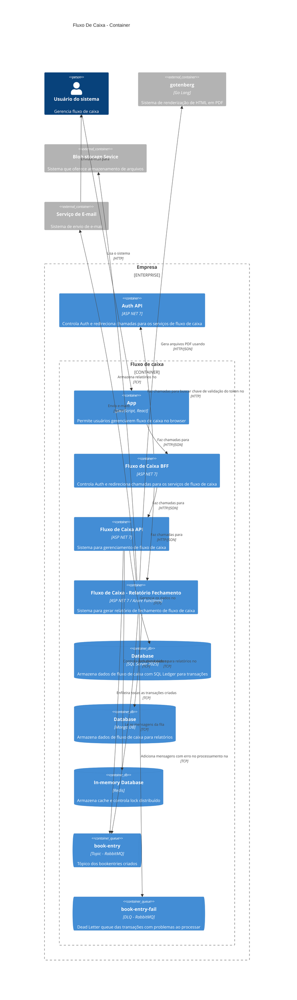

# Container - Fluxo De Caixa

```mermaid
C4Container
    title Fluxo De Caixa - Container

    Person(pessoa, "Usuário do sistema", "Gerencia fluxo de caixa")

    Enterprise_Boundary(boundaryEmpresa, "Empresa") {
        Container_Boundary(boundaryFluxoDeCaixa, "Fluxo de caixa") {
            Container(fluxoDeCaixaApp, "App", "JavaScript, React", "Permite usuários gerenciarem fluxo de caixa no browser")
            Container(fluxoDeCaixaBff, "Fluxo de Caixa BFF", "ASP NET 7", "Controla Auth e redireciona chamadas para os serviços de fluxo de caixa")
            Container(fluxoDeCaixaApi, "Fluxo de Caixa API", "ASP NET 7", "Sistema para gerenciamento de fluxo de caixa")
            Container(fluxoDeCaixaReportApi, "Fluxo de Caixa - Relatório Fechamento", "ASP NET 7 / Azure Functions", "Sistema para gerar relatório de fechamento de fluxo de caixa")

            ContainerDb(sqlserver, "Database", "SQL Server 2025", "Armazena dados de fluxo de caixa com SQL Ledger para transações")
            ContainerDb(mongodb, "Database", "Mongo DB", "Armazena dados de fluxo de caixa para relatórios")
            ContainerDb(redis, "In-memory Database", "Redis", "Armazena cache e controla lock distribuído")

            ContainerQueue(transactionQueue, "book-entry", "Topic - RabbitMQ", "Tópico dos bookentries criados")
            ContainerQueue(transacionDlq, "book-entry-fail", "DLQ - RabbitMQ", "Dead Letter queue das transações com problemas ao processar")
        }

        Container(authApi, "Auth API", "ASP NET 7", "Controla Auth e redireciona chamadas para os serviços de fluxo de caixa")
    }

    Container_Ext(gotenberg, "gotenberg", "Go Lang", "Sistema de renderização de HTML em PDF")
    Container_Ext(blobStorage, "Blob storage Sevice", "", "Sistema que oferece armazenamento de arquivos")
    Container_Ext(mailSystem, "Serviço de E-mail", "", "Sistema de envio de e-mail")

    Rel(pessoa, fluxoDeCaixaApp, "Usa o sistema", "HTTP")
    Rel(mailSystem, pessoa, "Envia e-mail para")

    Rel(fluxoDeCaixaApp, fluxoDeCaixaBff, "Faz chamadas para", "HTTP/JSON")

    Rel(fluxoDeCaixaBff, fluxoDeCaixaApi, "Faz chamadas para", "HTTP/JSON")
    Rel(fluxoDeCaixaBff, fluxoDeCaixaReportApi, "Faz chamadas para", "HTTP/JSON")
    Rel(fluxoDeCaixaBff, authApi, "Faz chamadas para buscar chave de validação do token no", "HTTP")

    Rel(fluxoDeCaixaApi, sqlserver, "Gerencia os dados no", "TCP")
    Rel(fluxoDeCaixaApi, transactionQueue, "Enfileira todas as transações criadas", "TCP")
    Rel(fluxoDeCaixaApi, redis, "Controla lock distribuído no", "TCP")

    Rel(fluxoDeCaixaReportApi, transactionQueue, "Le as mensagens da fila", "TCP")
    Rel(fluxoDeCaixaReportApi, transacionDlq, "Adiciona mensagens com erro no processamento na", "TCP")
    Rel(fluxoDeCaixaReportApi, mongodb, "Armazena dados para relatórios no", "TCP")
    Rel(fluxoDeCaixaReportApi, blobStorage, "Armazena relatórios no", "TCP")
    Rel(fluxoDeCaixaReportApi, gotenberg, "Gera arquivos PDF usando", "HTTP/JSON")
    Rel(fluxoDeCaixaReportApi, mailSystem, "Envia e-mails", "SMTP")
```