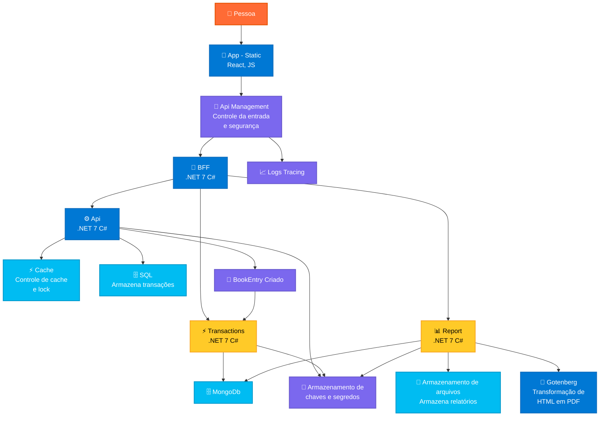

# Cloud - Fluxo de Caixa - Azure

```mermaid
graph TB
    %% Styling
    classDef azureApp fill:#0078D4,stroke:#106ebe,stroke-width:2px,color:#ffffff
    classDef azureContainer fill:#0078D4,stroke:#106ebe,stroke-width:2px,color:#ffffff
    classDef azureFunction fill:#FFCA28,stroke:#F9A825,stroke-width:2px,color:#000000
    classDef azureDatabase fill:#00BCF2,stroke:#0099CC,stroke-width:2px,color:#ffffff
    classDef azureStorage fill:#00BCF2,stroke:#0099CC,stroke-width:2px,color:#ffffff
    classDef azureService fill:#7B68EE,stroke:#6A5ACD,stroke-width:2px,color:#ffffff
    classDef person fill:#FF6B35,stroke:#E55100,stroke-width:2px,color:#ffffff

    %% Actors
    Pessoa[👤 Pessoa]:::person

    %% Web Apps
    App[📱 App - Static<br/>React, JS]:::azureApp

    %% Container Apps
    BFF[🔀 BFF<br/>.NET 7 C#]:::azureContainer
    API[⚙️ Api<br/>.NET 7 C#]:::azureContainer
    Gotenberg[📄 Gotenberg<br/>Transformação de<br/>HTML em PDF]:::azureContainer

    %% Functions
    FunctionRegistro[⚡ Transactions<br/>.NET 7 C#]:::azureFunction
    FunctionRelatorio[📊 Report<br/>.NET 7 C#]:::azureFunction

    %% Databases
    MongoDB[🗄️ MongoDb]:::azureDatabase
    RedisCache[⚡ Cache<br/>Controle de cache<br/>e lock]:::azureDatabase
    SqlDb[🗄️ SQL<br/>Armazena transações]:::azureDatabase

    %% Storage
    StaticBlobStorage[💾 Armazenamento de arquivos<br/>Armazena relatórios]:::azureStorage

    %% Service Bus
    Topic[📨 BookEntry Criado]:::azureService

    %% Management Services
    ApiManagement[🔐 Api Management<br/>Controle da entrada<br/>e segurança]:::azureService
    AzureKeyVault[🔑 Armazenamento de<br/>chaves e segredos]:::azureService
    ApplicationInsights[📈 Logs Tracing]:::azureService

    %% Relationships
    Pessoa --> App
    App --> ApiManagement
    ApiManagement --> BFF
    ApiManagement --> ApplicationInsights

    BFF --> API
    BFF --> FunctionRegistro
    BFF --> FunctionRelatorio

    API --> SqlDb
    API --> RedisCache
    API --> Topic
    API --> AzureKeyVault

    Topic --> FunctionRegistro
    FunctionRegistro --> MongoDB
    FunctionRegistro --> AzureKeyVault

    FunctionRelatorio --> StaticBlobStorage
    FunctionRelatorio --> Gotenberg
    FunctionRelatorio --> MongoDB
    FunctionRelatorio --> AzureKeyVault
```