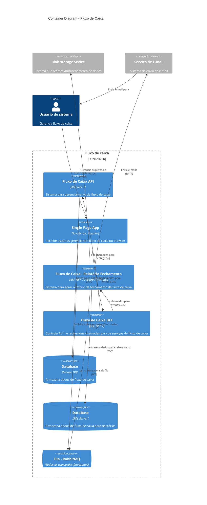

# Container

```mermaid
C4Context
    title Container Diagram - Fluxo de Caixa

      Container_Boundary(boundary-fluxo-de-caixa, "Fluxo de caixa") {
        Container(fluxo-de-caixa-api, "Fluxo de Caixa API", "ASP NET 7", "Sistema para gerenciamento de fluxo de caixa")
        Container(fluxo-de-caixa-app, "Single-Page App", "JavaScript, Angular", "Permite usuários gerenciarem fluxo de caixa no browser")
        Container(fluxo-de-caixa-report-api, "Fluxo de Caixa - Relatório Fechamento", "ASP NET 7 / Azure Functions", "Sistema para gerar relatório de fechamento de fluxo de caixa")
        Container(fluxo-de-caixa-bff, "Fluxo de Caixa BFF", "ASP NET 7", "Controla Auth e redireciona chamadas para os serviços de fluxo de caixa")

        ContainerDb(mongodb, "Database", "Mongo DB", "Armazena dados de fluxo de caixa")
        ContainerDb(sql-server, "Database", "SQL Server", "Armazena dados de fluxo de caixa para relatórios")
        ContainerQueue(transaction-queue, "Fila - RabbitMQ", "Todas as transações finalizadas")
    }

    Container_Ext(blob-storage, "Blob storage Sevice", "", "Sistema que oferece armazenamento de dados")
    Container_Ext(mail-system, "Serviço de E-mail", "", "Sistema de envio de e-mail")
    Person(pessoa, "Usuário do sistema", "Gerencia fluxo de caixa")

    Rel(fluxo-de-caixa-api, mongodb, "Gerencia os dados no", "TCP")
    Rel(fluxo-de-caixa-api, transaction-queue, "Enfileira todas as transações criadas", "TCP")

    Rel(fluxo-de-caixa-report-api, transaction-queue, "Le as mensagens da fila", "TCP")
    Rel(fluxo-de-caixa-report-api, sql-server, "Armazena dados para relatórios no", "TCP")
    Rel(fluxo-de-caixa-report-api, blob-storage, "Gerencia arquivos no", "TCP")


    Rel(fluxo-de-caixa-app, fluxo-de-caixa-bff, "Faz chamadas para", "HTTP/JSON")

    Rel(fluxo-de-caixa-bff, fluxo-de-caixa-api, "Faz chamadas para", "HTTP/JSON")
    Rel(fluxo-de-caixa-bff, fluxo-de-caixa-report-api, "Faz chamadas para", "HTTP/JSON")

    Rel(pessoa, fluxo-de-caixa-app, "Usa o sistema", "HTTP")
    Rel(fluxo-de-caixa-report-api, mail-system, "Envia e-mails", "SMTP")
    Rel(mail-system, pessoa, "Envia e-mail para")


```