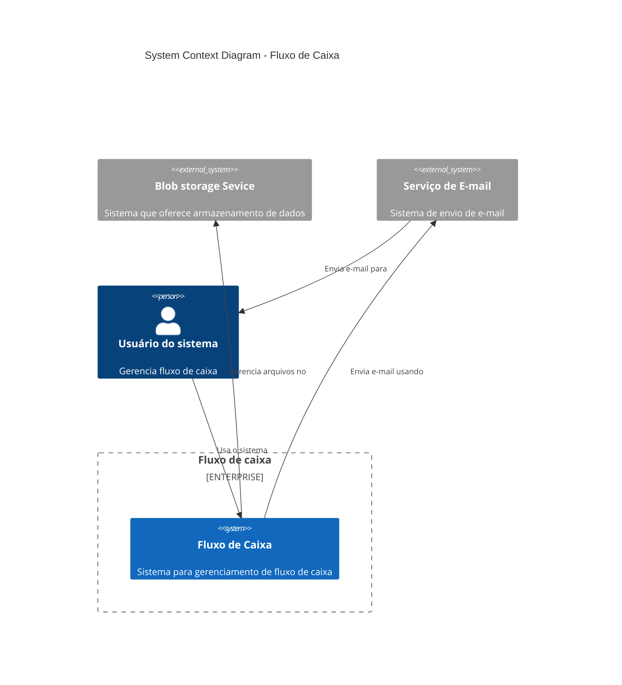

# System Context

```mermaid
C4Context
    title System Context Diagram - Fluxo de Caixa

    Enterprise_Boundary(boundary-fluxo-de-caixa, "Fluxo de caixa") {
      System(fluxoDeCaixa, "Fluxo de Caixa", "Sistema para gerenciamento de fluxo de caixa")
    }

    System_Ext(blobStorage, "Blob storage Sevice", "Sistema que oferece armazenamento de dados")
    System_Ext(mailSystem, "Serviço de E-mail", "Sistema de envio de e-mail")
    Person(pessoa, "Usuário do sistema", "Gerencia fluxo de caixa")

    Rel(pessoa, fluxoDeCaixa, "Usa o sistema")
    Rel(fluxoDeCaixa, blobStorage, "Gerencia arquivos no")
    Rel(fluxoDeCaixa, mailSystem, "Envia e-mail usando")
    Rel(mailSystem, pessoa, "Envia e-mail para")
```